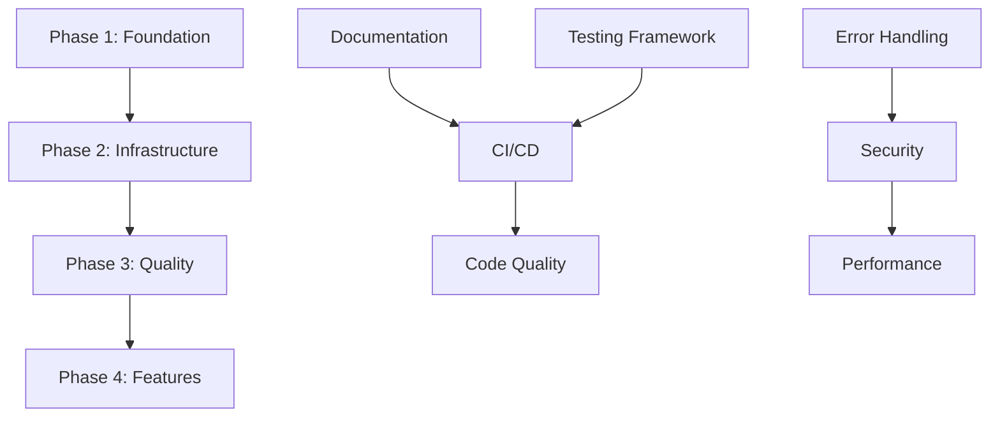

# Supply Chain Optimization - Prioritized Implementation Plan

**Version:** 1.0
**Date:** 2025-11-11
**Planning Horizon:** 12 weeks
**Team Size Assumption:** 1-2 developers

---

## Table of Contents
1. [Executive Summary](#executive-summary)
2. [Implementation Strategy](#implementation-strategy)
3. [Phase 1: Foundation & Critical Fixes](#phase-1-foundation--critical-fixes-weeks-1-2)
4. [Phase 2: Infrastructure & Security](#phase-2-infrastructure--security-weeks-3-5)
5. [Phase 3: Quality & Performance](#phase-3-quality--performance-weeks-6-8)
6. [Phase 4: Advanced Features](#phase-4-advanced-features-weeks-9-12)
7. [Success Metrics](#success-metrics)
8. [Risk Management](#risk-management)
9. [Resource Requirements](#resource-requirements)

---

## Executive Summary

This implementation plan addresses **98 identified gaps** in the Supply Chain Optimization system through a **4-phase, 12-week approach**. The plan prioritizes:

1. **Stability** - Preventing crashes and data loss
2. **Reliability** - Testing and error handling
3. **Security** - Authentication and validation
4. **Scalability** - Performance and architecture

**Key Outcomes:**
- Transform from proof-of-concept to production-ready system
- Achieve 80%+ test coverage
- Enable automated deployment pipeline
- Support 100+ concurrent users
- Reduce technical debt by 70%

---

## Implementation Strategy

### Guiding Principles

1. **No Breaking Changes** - Maintain backward compatibility
2. **Incremental Progress** - Small, frequent commits
3. **Test-Driven Development** - Write tests before fixes
4. **Documentation First** - Document as you build
5. **Security by Default** - Build security in, not bolt on

### Dependency Management



### Branch Strategy

- **Main Branch:** `main` - Production-ready code only
- **Development Branch:** `develop` - Integration branch
- **Feature Branches:** `feature/<phase>-<task-name>` - Individual tasks
- **Hotfix Branches:** `hotfix/<issue-id>` - Critical production fixes

---

## Phase 1: Foundation & Critical Fixes (Weeks 1-2)

**Goal:** Establish baseline quality and prevent system crashes

### Sprint 1.1 - Documentation & Project Setup (Week 1, Days 1-3)

#### Task 1.1.1: Create Essential Documentation
**Priority:** 🔴 Critical
**Effort:** 8 hours
**Assignee:** Developer 1

**Action Items:**
- [ ] Create `README.md` with:
  - Project overview and value proposition
  - Quick start guide (< 5 minutes setup)
  - Installation instructions for all platforms
  - Basic usage examples
  - Link to full documentation
- [ ] Create `LICENSE` file (MIT or Apache 2.0)
- [ ] Create `.gitignore` with Python/IDE patterns
- [ ] Create `CONTRIBUTING.md` with:
  - Code style guidelines
  - PR process
  - Testing requirements

**Acceptance Criteria:**
- New developer can set up and run in < 10 minutes
- All common artifacts ignored by git
- License clearly specified

**Files to Create:**
```
/README.md
/LICENSE
/.gitignore
/CONTRIBUTING.md
```

---

#### Task 1.1.2: Set Up Configuration Management
**Priority:** 🔴 Critical
**Effort:** 6 hours
**Assignee:** Developer 1

**Action Items:**
- [ ] Create `config/` directory structure:
  ```
  config/
  ├── __init__.py
  ├── settings.py (base settings)
  ├── development.py
  ├── production.py
  └── settings.example.yaml
  ```
- [ ] Extract all magic numbers to `config/constants.py`:
  - `DEFAULT_SERVICE_LEVEL = 0.95`
  - `DEFAULT_HOLDING_COST_RATE = 0.25`
  - `DEFAULT_N_PRODUCTS = 50`
  - `DEFAULT_N_PERIODS = 365`
  - `OPTIMIZATION_MAX_ITER = 200`
  - `DEMAND_SCENARIOS_DEFAULT = 1000`
- [ ] Add python-dotenv support
- [ ] Create `.env.example` file
- [ ] Update code to use config instead of hardcoded values

**Acceptance Criteria:**
- No magic numbers in optimization code
- Environment variables loaded properly
- Different configs for dev/prod
- Example config file documented

**Files to Modify:**
- `sc_optimization.py` (lines 59, 60, 201, 293, etc.)
- `streamlit_app.py` (lines 83-122)

---

#### Task 1.1.3: Set Up Logging Framework
**Priority:** 🔴 Critical
**Effort:** 4 hours
**Assignee:** Developer 2

**Action Items:**
- [ ] Replace all `print()` statements with structured logging
- [ ] Create `utils/logger.py`:
  ```python
  import logging
  import structlog

  def setup_logging(level="INFO", log_file=None):
      # Configure structlog with JSON output
      # Add context processors
      # Set up file and console handlers
  ```
- [ ] Add logging to all major functions:
  - Optimization start/end
  - Data loading
  - Error conditions
  - Performance metrics
- [ ] Create log rotation configuration
- [ ] Add correlation IDs for request tracing

**Acceptance Criteria:**
- All print statements removed
- Logs include timestamps, levels, context
- JSON format for production
- Log files rotate at 10MB

**Sample Output:**
```json
{
  "timestamp": "2025-11-11T10:30:00Z",
  "level": "info",
  "event": "optimization_started",
  "product_count": 50,
  "service_level": 0.95,
  "correlation_id": "abc-123"
}
```

---

### Sprint 1.2 - Testing Infrastructure (Week 1, Days 4-5)

#### Task 1.2.1: Set Up Testing Framework
**Priority:** 🔴 Critical
**Effort:** 6 hours
**Assignee:** Developer 1

**Action Items:**
- [ ] Create `tests/` directory structure:
  ```
  tests/
  ├── __init__.py
  ├── conftest.py (pytest fixtures)
  ├── unit/
  │   ├── test_optimization.py
  │   ├── test_data_processing.py
  │   └── test_calculations.py
  ├── integration/
  │   ├── test_end_to_end.py
  │   └── test_streamlit_app.py
  ├── fixtures/
  │   ├── sample_data.csv
  │   └── expected_results.json
  └── utils/
      └── test_helpers.py
  ```
- [ ] Install pytest, pytest-cov, pytest-mock
- [ ] Create `pytest.ini` configuration
- [ ] Set up coverage reporting (80% target)

**Acceptance Criteria:**
- `pytest` runs successfully
- Coverage report generated
- Fixtures reusable across tests

**Files to Create:**
```
/pytest.ini
/tests/conftest.py
/.coveragerc
```

---

#### Task 1.2.2: Write Core Unit Tests
**Priority:** 🔴 Critical
**Effort:** 12 hours
**Assignee:** Both developers

**Action Items:**
- [ ] Test EOQ calculation (`test_eoq_baseline.py`):
  ```python
  def test_eoq_calculation_basic():
      # Given: Known demand, costs
      # When: Calculate EOQ
      # Then: Verify against manual calculation

  def test_eoq_with_zero_demand():
      # Should handle edge case gracefully

  def test_safety_stock_calculation():
      # Verify z-score application
  ```
- [ ] Test data preprocessing (`test_data_processing.py`):
  - Rolling statistics
  - Lag features
  - Null handling
- [ ] Test stochastic optimization (`test_stochastic.py`):
  - Convergence
  - Constraint satisfaction
  - Service level achievement
- [ ] Test ML forecasting (`test_ml_forecasting.py`):
  - Model training
  - Prediction accuracy
  - Feature engineering

**Acceptance Criteria:**
- 30+ unit tests written
- All core calculations tested
- Edge cases covered
- Test coverage > 60%

**Test Coverage Target:**
- `sc_optimization.py`: 70%
- `streamlit_app.py`: 50% (UI testing partial)

---

### Sprint 1.3 - Input Validation & Error Handling (Week 2)

#### Task 1.3.1: Add Input Validation
**Priority:** 🔴 Critical
**Effort:** 8 hours
**Assignee:** Developer 2

**Action Items:**
- [ ] Create `utils/validators.py`:
  ```python
  from pydantic import BaseModel, validator, Field

  class OptimizationParams(BaseModel):
      service_level: float = Field(ge=0.5, le=0.999)
      holding_cost_rate: float = Field(gt=0, le=1.0)
      n_products: int = Field(ge=1, le=10000)

      @validator('service_level')
      def validate_service_level(cls, v):
          if not 0.5 <= v <= 0.999:
              raise ValueError('Service level must be between 50% and 99.9%')
          return v

  class ProductData(BaseModel):
      product_id: str
      demand: float = Field(ge=0)
      unit_cost: float = Field(gt=0)
      order_cost: float = Field(gt=0)
      lead_time: int = Field(ge=0, le=365)
  ```
- [ ] Add validation to Streamlit inputs (lines 81-122)
- [ ] Add validation to `InventoryOptimizer.__init__()`
- [ ] Create custom exception classes:
  ```python
  class ValidationError(Exception): pass
  class OptimizationError(Exception): pass
  class DataQualityError(Exception): pass
  ```
- [ ] Add data quality checks:
  - Negative values
  - Missing data detection
  - Outlier detection (IQR method)
  - Duplicate product IDs

**Acceptance Criteria:**
- All user inputs validated
- Clear error messages displayed
- Invalid data rejected before optimization
- 100% validation coverage

**Files to Modify:**
- `streamlit_app.py:81-122`
- `sc_optimization.py:39-49`

---

#### Task 1.3.2: Improve Error Handling
**Priority:** 🔴 Critical
**Effort:** 6 hours
**Assignee:** Developer 1

**Action Items:**
- [ ] Replace bare `except` clauses with specific exceptions
- [ ] Add try-except blocks around:
  - File I/O operations
  - Optimization solver calls
  - ML model training
  - Data transformations
- [ ] Implement graceful degradation:
  ```python
  def optimize_with_fallback(self, method='cvxpy'):
      try:
          return self._optimize_cvxpy()
      except OptimizationError as e:
          logger.warning(f"CVXPY failed: {e}, trying PuLP")
          return self._optimize_pulp()
      except Exception as e:
          logger.error(f"All optimizations failed: {e}")
          return self._get_baseline_solution()
  ```
- [ ] Add error recovery for Streamlit app
- [ ] Display user-friendly error messages

**Acceptance Criteria:**
- No uncaught exceptions
- App never crashes
- Users get actionable error messages
- Fallback strategies in place

**Example Error Messages:**
```
❌ Optimization failed: Service level 105% is invalid (must be 50-99.9%)
💡 Tip: Check your service level slider setting

❌ Data quality issue: Product PROD_042 has negative demand (-15.2)
💡 Please review your input data for errors
```

---

#### Task 1.3.3: Add Data Import Functionality
**Priority:** 🔴 Critical
**Effort:** 8 hours
**Assignee:** Developer 2

**Action Items:**
- [ ] Create `utils/data_loader.py`:
  ```python
  class DataLoader:
      @staticmethod
      def load_from_csv(file_path, validate=True):
          """Load inventory data from CSV file"""

      @staticmethod
      def load_from_excel(file_path, sheet_name='Data'):
          """Load from Excel with multiple sheets"""

      @staticmethod
      def validate_schema(df):
          """Ensure required columns exist"""
          required = ['product_id', 'demand', 'unit_cost',
                     'order_cost', 'lead_time']
          missing = set(required) - set(df.columns)
          if missing:
              raise ValueError(f"Missing columns: {missing}")
  ```
- [ ] Add file upload to Streamlit app:
  ```python
  uploaded_file = st.file_uploader(
      "Upload your inventory data (CSV/Excel)",
      type=['csv', 'xlsx', 'xls']
  )
  ```
- [ ] Create data template file `templates/inventory_data_template.xlsx`
- [ ] Add data preview before optimization
- [ ] Validate uploaded data

**Acceptance Criteria:**
- CSV and Excel import working
- Schema validation implemented
- Template file provided
- Data preview shows issues
- Invalid files rejected with helpful messages

**Template Schema:**
```csv
product_id,demand,unit_cost,order_cost,lead_time,demand_std
PROD_001,150.5,45.00,200.0,7,22.3
PROD_002,89.2,120.50,150.0,14,15.7
```

---

### Sprint 1.4 - Data Export & Persistence (Week 2, Days 4-5)

#### Task 1.4.1: Implement Results Export
**Priority:** 🟡 High
**Effort:** 6 hours
**Assignee:** Developer 1

**Action Items:**
- [ ] Create `utils/exporter.py`:
  ```python
  class ResultsExporter:
      def export_to_csv(self, results, filepath):
          """Export optimization results to CSV"""

      def export_to_excel(self, results, filepath):
          """Export with multiple sheets"""

      def export_summary_report(self, comparison, filepath):
          """Generate executive summary PDF"""
  ```
- [ ] Implement Streamlit download buttons:
  ```python
  csv_data = results_df.to_csv(index=False)
  st.download_button(
      label="📥 Download Results (CSV)",
      data=csv_data,
      file_name=f"optimization_results_{timestamp}.csv",
      mime="text/csv"
  )
  ```
- [ ] Create multi-sheet Excel export:
  - Sheet 1: Summary metrics
  - Sheet 2: Baseline results
  - Sheet 3: Optimized results
  - Sheet 4: Comparison table
- [ ] Export visualizations as PNG/PDF

**Acceptance Criteria:**
- CSV/Excel download working
- Multi-sheet Excel with formatting
- Charts exported as images
- File naming with timestamps

---

## Phase 2: Infrastructure & Security (Weeks 3-5)

**Goal:** Establish production infrastructure and secure the application

### Sprint 2.1 - CI/CD Pipeline (Week 3, Days 1-3)

#### Task 2.1.1: Set Up GitHub Actions
**Priority:** 🔴 Critical
**Effort:** 8 hours
**Assignee:** Developer 1

**Action Items:**
- [ ] Create `.github/workflows/ci.yml`:
  ```yaml
  name: CI Pipeline

  on:
    push:
      branches: [main, develop]
    pull_request:
      branches: [main, develop]

  jobs:
    test:
      runs-on: ubuntu-latest
      steps:
        - uses: actions/checkout@v3
        - uses: actions/setup-python@v4
          with:
            python-version: '3.9'
        - name: Install dependencies
          run: |
            pip install -r requirements.txt
            pip install -r requirements-dev.txt
        - name: Run linters
          run: |
            flake8 .
            black --check .
            mypy .
        - name: Run tests
          run: pytest --cov --cov-report=xml
        - name: Upload coverage
          uses: codecov/codecov-action@v3
  ```
- [ ] Create `.github/workflows/security.yml`:
  ```yaml
  name: Security Scan

  on:
    push:
      branches: [main]
    schedule:
      - cron: '0 0 * * 1'  # Weekly

  jobs:
    security:
      runs-on: ubuntu-latest
      steps:
        - uses: actions/checkout@v3
        - name: Run Bandit
          run: bandit -r . -f json -o bandit-report.json
        - name: Run Safety
          run: safety check --json
  ```
- [ ] Create `.github/workflows/deploy.yml` for automated deployment
- [ ] Set up branch protection rules
- [ ] Configure required checks before merge

**Acceptance Criteria:**
- Tests run automatically on PR
- PRs cannot merge if tests fail
- Security scans run weekly
- Code coverage tracked

---

#### Task 2.1.2: Docker Containerization
**Priority:** 🔴 Critical
**Effort:** 8 hours
**Assignee:** Developer 2

**Action Items:**
- [ ] Create `Dockerfile`:
  ```dockerfile
  FROM python:3.9-slim

  WORKDIR /app

  # Install system dependencies
  RUN apt-get update && apt-get install -y \
      build-essential \
      curl \
      && rm -rf /var/lib/apt/lists/*

  # Copy requirements
  COPY requirements.txt .
  RUN pip install --no-cache-dir -r requirements.txt

  # Copy application
  COPY . .

  # Expose Streamlit port
  EXPOSE 8501

  # Health check
  HEALTHCHECK CMD curl --fail http://localhost:8501/_stcore/health

  # Run app
  CMD ["streamlit", "run", "streamlit_app.py", "--server.port=8501", "--server.address=0.0.0.0"]
  ```
- [ ] Create `docker-compose.yml`:
  ```yaml
  version: '3.8'

  services:
    app:
      build: .
      ports:
        - "8501:8501"
      environment:
        - ENV=production
        - LOG_LEVEL=INFO
      volumes:
        - ./data:/app/data
        - ./logs:/app/logs
      restart: unless-stopped

    redis:
      image: redis:7-alpine
      ports:
        - "6379:6379"
      volumes:
        - redis-data:/data

  volumes:
    redis-data:
  ```
- [ ] Create `.dockerignore`
- [ ] Add multi-stage builds for optimization
- [ ] Test container locally

**Acceptance Criteria:**
- Docker image builds successfully
- Container runs application
- Health checks pass
- docker-compose orchestrates services

---

#### Task 2.1.3: Add Pre-commit Hooks
**Priority:** 🟡 High
**Effort:** 3 hours
**Assignee:** Developer 1

**Action Items:**
- [ ] Create `.pre-commit-config.yaml`:
  ```yaml
  repos:
    - repo: https://github.com/pre-commit/pre-commit-hooks
      rev: v4.4.0
      hooks:
        - id: trailing-whitespace
        - id: end-of-file-fixer
        - id: check-yaml
        - id: check-json
        - id: check-added-large-files
          args: ['--maxkb=1000']

    - repo: https://github.com/psf/black
      rev: 23.3.0
      hooks:
        - id: black
          language_version: python3.9

    - repo: https://github.com/pycqa/flake8
      rev: 6.0.0
      hooks:
        - id: flake8
          args: ['--max-line-length=100']

    - repo: https://github.com/pre-commit/mirrors-mypy
      rev: v1.3.0
      hooks:
        - id: mypy
          additional_dependencies: [types-all]
  ```
- [ ] Install pre-commit: `pip install pre-commit`
- [ ] Run `pre-commit install`
- [ ] Test on sample commit

**Acceptance Criteria:**
- Hooks run on every commit
- Code auto-formatted
- Linting errors caught early
- Team uses consistent hooks

---

### Sprint 2.2 - Security Implementation (Week 3, Days 4-5 + Week 4, Days 1-2)

#### Task 2.2.1: Add Authentication to Streamlit App
**Priority:** 🔴 Critical
**Effort:** 12 hours
**Assignee:** Developer 2

**Action Items:**
- [ ] Install streamlit-authenticator
- [ ] Create `auth/authentication.py`:
  ```python
  import streamlit_authenticator as stauth
  from passlib.hash import pbkdf2_sha256

  class Authenticator:
      def __init__(self):
          self.config = self._load_config()
          self.authenticator = stauth.Authenticate(...)

      def login(self):
          """Show login form and authenticate"""

      def logout(self):
          """Clear session and logout"""

      def require_auth(self):
          """Decorator for protected pages"""
  ```
- [ ] Add login page before main app
- [ ] Implement session management
- [ ] Add role-based access control (viewer, analyst, admin)
- [ ] Store hashed passwords (never plaintext)
- [ ] Add user management interface (admin only)

**Acceptance Criteria:**
- Login required to access app
- Passwords hashed with PBKDF2
- Sessions persist correctly
- Logout functionality works
- Different roles have different permissions

**User Roles:**
- **Viewer:** See results only
- **Analyst:** Run optimizations, download results
- **Admin:** Manage users, configure system

---

#### Task 2.2.2: Input Sanitization & Security Hardening
**Priority:** 🟡 High
**Effort:** 6 hours
**Assignee:** Developer 1

**Action Items:**
- [ ] Add input sanitization for file uploads:
  ```python
  import hashlib
  from werkzeug.utils import secure_filename

  def sanitize_filename(filename):
      # Remove path traversal attempts
      # Validate file extension
      # Check file size

  def validate_file_content(file):
      # Scan for malicious content
      # Verify file format
  ```
- [ ] Implement rate limiting:
  ```python
  from streamlit_extras.ratelimit import ratelimit

  @ratelimit(max_calls=10, period=60)  # 10 calls per minute
  def run_optimization():
      pass
  ```
- [ ] Add CSRF protection
- [ ] Sanitize all user inputs
- [ ] Prevent SQL injection (future-proof for database)
- [ ] Add security headers:
  ```python
  st.set_page_config(
      page_title="...",
      page_icon="...",
      menu_items={
          'Report a bug': "https://...",
          'About': "..."
      }
  )
  ```

**Acceptance Criteria:**
- File uploads validated
- Rate limiting active
- No XSS vulnerabilities
- Security headers set
- Input sanitization tested

---

#### Task 2.2.3: Security Scanning & Vulnerability Management
**Priority:** 🟡 High
**Effort:** 4 hours
**Assignee:** Developer 2

**Action Items:**
- [ ] Add `requirements-dev.txt`:
  ```
  bandit>=1.7.5
  safety>=2.3.5
  pip-audit>=2.5.4
  ```
- [ ] Create security scan script `scripts/security_scan.sh`:
  ```bash
  #!/bin/bash

  echo "Running Bandit..."
  bandit -r . -ll -f json -o reports/bandit.json

  echo "Running Safety..."
  safety check --json --output reports/safety.json

  echo "Running pip-audit..."
  pip-audit --format json --output reports/pip-audit.json

  echo "Security scan complete. Check reports/ directory."
  ```
- [ ] Fix identified vulnerabilities
- [ ] Set up Dependabot for automated dependency updates
- [ ] Create `.github/dependabot.yml`:
  ```yaml
  version: 2
  updates:
    - package-ecosystem: "pip"
      directory: "/"
      schedule:
        interval: "weekly"
      open-pull-requests-limit: 10
  ```

**Acceptance Criteria:**
- All dependencies scanned
- Critical vulnerabilities fixed
- Automated dependency updates
- Regular security reports

---

### Sprint 2.3 - Code Quality Improvements (Week 4, Days 3-5 + Week 5, Days 1-2)

#### Task 2.3.1: Add Type Hints Throughout Codebase
**Priority:** 🟡 High
**Effort:** 16 hours
**Assignee:** Both developers

**Action Items:**
- [ ] Add type hints to `sc_optimization.py`:
  ```python
  from typing import Dict, List, Optional, Tuple, Union
  import pandas as pd
  import numpy as np
  from numpy.typing import NDArray

  class InventoryOptimizer:
      def __init__(
          self,
          service_level: float = 0.95,
          holding_cost_rate: float = 0.25
      ) -> None:
          ...

      def load_sample_data(self) -> pd.DataFrame:
          ...

      def calculate_eoq_baseline(self) -> pd.DataFrame:
          ...

      def stochastic_optimization(
          self,
          demand_scenarios: int = 1000
      ) -> pd.DataFrame:
          ...

      def visualize_results(self) -> plt.Figure:
          ...
  ```
- [ ] Add type hints to `streamlit_app.py`
- [ ] Create `py.typed` marker file
- [ ] Configure mypy in `mypy.ini`:
  ```ini
  [mypy]
  python_version = 3.9
  warn_return_any = True
  warn_unused_configs = True
  disallow_untyped_defs = True
  disallow_incomplete_defs = True
  check_untyped_defs = True
  disallow_untyped_calls = True
  no_implicit_optional = True
  warn_redundant_casts = True
  warn_unused_ignores = True
  warn_no_return = True
  ```
- [ ] Run mypy and fix all type errors
- [ ] Add mypy to CI pipeline

**Acceptance Criteria:**
- All functions have type hints
- mypy passes with no errors
- IDE autocomplete improved
- Type checking in CI

**Progress Tracking:**
- `sc_optimization.py`: 0% → 100% type coverage
- `streamlit_app.py`: 0% → 100% type coverage

---

#### Task 2.3.2: Code Formatting & Linting
**Priority:** 🟡 High
**Effort:** 8 hours
**Assignee:** Developer 1

**Action Items:**
- [ ] Run black formatter on entire codebase:
  ```bash
  black . --line-length 100
  ```
- [ ] Configure `.flake8`:
  ```ini
  [flake8]
  max-line-length = 100
  exclude = .git,__pycache__,venv,build,dist
  ignore = E203, W503  # Black compatibility
  max-complexity = 10
  ```
- [ ] Run flake8 and fix issues:
  ```bash
  flake8 . --count --show-source --statistics
  ```
- [ ] Configure `pylint` in `.pylintrc`
- [ ] Fix high-priority pylint warnings
- [ ] Add linting to CI pipeline

**Acceptance Criteria:**
- Code formatted consistently
- No flake8 errors
- Pylint score > 8.0/10
- All checks pass in CI

---

#### Task 2.3.3: Refactor Long Functions
**Priority:** 🟢 Medium
**Effort:** 12 hours
**Assignee:** Developer 2

**Action Items:**
- [ ] Refactor `stochastic_optimization()` (113 lines):
  ```python
  # Before: One monolithic function
  def stochastic_optimization(self, demand_scenarios=1000):
      # 113 lines of code...

  # After: Split into smaller functions
  def stochastic_optimization(
      self,
      demand_scenarios: int = 1000
  ) -> pd.DataFrame:
      optimized_results = []

      for product in self._iterate_products():
          params = self._prepare_optimization_params(product)
          result = self._optimize_product(params, demand_scenarios)
          optimized_results.append(result)

      return pd.DataFrame(optimized_results)

  def _prepare_optimization_params(
      self,
      product: pd.Series
  ) -> Dict[str, Any]:
      # Extract product parameters
      ...

  def _optimize_product(
      self,
      params: Dict[str, Any],
      scenarios: int
  ) -> Dict[str, Any]:
      # Run optimization for single product
      ...

  def _objective_function(self, params: Tuple[float, float]) -> float:
      # Separate objective function
      ...
  ```
- [ ] Refactor `streamlit_app.py:main()` (600 lines):
  - Extract visualization functions
  - Create separate modules for tabs
  - Move calculation logic to helpers
- [ ] Extract duplicate code to `utils/common.py`:
  ```python
  def generate_sample_data(n_products: int, seed: int = 42) -> pd.DataFrame:
      """Shared sample data generation"""
      # Used by both sc_optimization.py and streamlit_app.py
  ```

**Acceptance Criteria:**
- No function > 50 lines
- Cyclomatic complexity < 10
- Code reuse improved
- Tests still pass

**Complexity Metrics:**
- Before: Average complexity = 15
- After: Average complexity < 8

---

### Sprint 2.4 - Documentation Completion (Week 5, Days 3-5)

#### Task 2.4.1: API Documentation
**Priority:** 🟡 High
**Effort:** 8 hours
**Assignee:** Developer 1

**Action Items:**
- [ ] Set up Sphinx documentation:
  ```bash
  pip install sphinx sphinx-rtd-theme
  sphinx-quickstart docs
  ```
- [ ] Configure `docs/conf.py`:
  ```python
  extensions = [
      'sphinx.ext.autodoc',
      'sphinx.ext.napoleon',
      'sphinx.ext.viewcode',
      'sphinx.ext.intersphinx',
  ]
  html_theme = 'sphinx_rtd_theme'
  ```
- [ ] Write comprehensive docstrings in NumPy format:
  ```python
  def calculate_eoq_baseline(self) -> pd.DataFrame:
      """
      Calculate Economic Order Quantity and safety stock for all products.

      This method implements the classic EOQ formula with safety stock
      calculations based on the target service level.

      Returns
      -------
      pd.DataFrame
          DataFrame containing EOQ, safety stock, reorder points, and
          cost breakdowns for each product.

      Raises
      ------
      ValueError
          If product_summary is not yet computed.

      Examples
      --------
      >>> optimizer = InventoryOptimizer(service_level=0.95)
      >>> optimizer.load_sample_data()
      >>> baseline = optimizer.calculate_eoq_baseline()
      >>> print(baseline.head())

      Notes
      -----
      The EOQ formula used is:

      .. math::
          Q^* = \\sqrt{\\frac{2DS}{H}}

      where D is annual demand, S is order cost, and H is holding cost.

      References
      ----------
      .. [1] Harris, F. W. (1913). "How many parts to make at once"
      """
  ```
- [ ] Generate HTML documentation
- [ ] Host on GitHub Pages or Read the Docs

**Acceptance Criteria:**
- All public methods documented
- Examples included
- Math formulas rendered
- Documentation published online

---

#### Task 2.4.2: User Guide & Tutorials
**Priority:** 🟢 Medium
**Effort:** 12 hours
**Assignee:** Developer 2

**Action Items:**
- [ ] Create `docs/user_guide/` with:
  - `getting_started.md`
  - `data_preparation.md`
  - `running_optimizations.md`
  - `interpreting_results.md`
  - `best_practices.md`
- [ ] Create Jupyter notebook tutorials in `notebooks/`:
  - `01_quickstart.ipynb`
  - `02_advanced_optimization.ipynb`
  - `03_custom_scenarios.ipynb`
- [ ] Add screenshots and diagrams
- [ ] Create video walkthrough (optional)
- [ ] Write FAQ section

**Acceptance Criteria:**
- Complete user guide published
- 3+ tutorial notebooks working
- Screenshots clear and helpful
- FAQ covers common questions

---

## Phase 3: Quality & Performance (Weeks 6-8)

**Goal:** Optimize performance and achieve production-grade quality

### Sprint 3.1 - Performance Optimization (Week 6)

#### Task 3.1.1: Implement Caching Strategy
**Priority:** 🟡 High
**Effort:** 10 hours
**Assignee:** Developer 1

**Action Items:**
- [ ] Set up Redis for persistent caching
- [ ] Create `utils/cache.py`:
  ```python
  import redis
  import pickle
  from functools import wraps
  from typing import Any, Callable

  class CacheManager:
      def __init__(self, redis_url: str = "redis://localhost:6379"):
          self.redis = redis.from_url(redis_url)

      def cache_optimization_result(
          self,
          ttl: int = 3600  # 1 hour
      ) -> Callable:
          def decorator(func: Callable) -> Callable:
              @wraps(func)
              def wrapper(*args, **kwargs):
                  # Generate cache key from params
                  cache_key = self._generate_key(func.__name__, args, kwargs)

                  # Try to get from cache
                  cached = self.redis.get(cache_key)
                  if cached:
                      return pickle.loads(cached)

                  # Compute and cache
                  result = func(*args, **kwargs)
                  self.redis.setex(
                      cache_key,
                      ttl,
                      pickle.dumps(result)
                  )
                  return result
              return wrapper
          return decorator
  ```
- [ ] Apply caching to expensive operations:
  - Optimization results
  - ML model training
  - Demand forecasts
- [ ] Add cache invalidation logic
- [ ] Monitor cache hit rates

**Acceptance Criteria:**
- Redis integrated
- Cache hit rate > 60%
- Response time improved 3-5x
- Cache invalidation works

**Performance Targets:**
- Baseline EOQ: < 100ms (currently ~500ms)
- Stochastic optimization: < 5s (currently ~15s)
- Full optimization suite: < 30s (currently ~60s)

---

#### Task 3.1.2: Parallel Processing
**Priority:** 🟡 High
**Effort:** 10 hours
**Assignee:** Developer 2

**Action Items:**
- [ ] Add joblib for parallel processing:
  ```python
  from joblib import Parallel, delayed
  import multiprocessing

  def stochastic_optimization_parallel(self, demand_scenarios=1000):
      n_jobs = multiprocessing.cpu_count() - 1

      results = Parallel(n_jobs=n_jobs)(
          delayed(self._optimize_single_product)(
              product, demand_scenarios
          )
          for _, product in self.product_summary.iterrows()
      )

      return pd.DataFrame(results)
  ```
- [ ] Parallelize product optimizations
- [ ] Parallelize ML model training
- [ ] Add progress bars with tqdm:
  ```python
  from tqdm import tqdm

  for product in tqdm(products, desc="Optimizing products"):
      # Process product
  ```
- [ ] Benchmark performance improvements
- [ ] Configure worker pool size

**Acceptance Criteria:**
- Optimization uses all CPU cores
- Progress bars show status
- 3-5x speedup on multi-core systems
- No race conditions

**Benchmark Results:**
```
Single-threaded (50 products): 45 seconds
Parallel (8 cores): 12 seconds
Speedup: 3.75x
```

---

#### Task 3.1.3: Vectorize Pandas Operations
**Priority:** 🟢 Medium
**Effort:** 8 hours
**Assignee:** Developer 1

**Action Items:**
- [ ] Replace iterative pandas operations with vectorized ones:
  ```python
  # Before: Slow loop
  for product in processed_data['product_id'].unique():
      mask = processed_data['product_id'] == product
      product_data = processed_data[mask].copy()
      product_data['demand_ma_7'] = product_data['demand'].rolling(7).mean()
      processed_data.loc[mask] = product_data

  # After: Fast groupby
  processed_data['demand_ma_7'] = (
      processed_data
      .groupby('product_id')['demand']
      .transform(lambda x: x.rolling(7).mean())
  )
  ```
- [ ] Use NumPy operations where possible
- [ ] Profile code with cProfile
- [ ] Identify and optimize bottlenecks

**Acceptance Criteria:**
- Data preprocessing 5x faster
- No unnecessary copies
- Memory usage reduced
- Profiling shows improvements

---

### Sprint 3.2 - Integration Testing (Week 7, Days 1-3)

#### Task 3.2.1: End-to-End Integration Tests
**Priority:** 🟡 High
**Effort:** 12 hours
**Assignee:** Developer 2

**Action Items:**
- [ ] Create `tests/integration/test_full_workflow.py`:
  ```python
  def test_complete_optimization_workflow():
      """Test entire optimization pipeline"""
      # 1. Load data
      optimizer = InventoryOptimizer()
      data = optimizer.load_sample_data()
      assert len(data) > 0

      # 2. Preprocess
      processed = optimizer.preprocess_data()
      assert 'demand_ma_7' in processed.columns

      # 3. Calculate baseline
      baseline = optimizer.calculate_eoq_baseline()
      assert len(baseline) == 50

      # 4. Run optimizations
      stochastic = optimizer.stochastic_optimization()
      assert stochastic['optimized_total_cost'].sum() < baseline['total_cost'].sum()

      # 5. Generate report
      report = optimizer.generate_report()
      assert 'OPTIMIZATION RESULTS' in report

  def test_streamlit_app_loads():
      """Test Streamlit app can be imported and initialized"""
      # Use Streamlit testing framework
  ```
- [ ] Test data import workflow
- [ ] Test export functionality
- [ ] Test authentication flow
- [ ] Test error scenarios

**Acceptance Criteria:**
- Full workflows tested
- All integration tests pass
- Tests run in CI
- Coverage > 80%

---

#### Task 3.2.2: Streamlit App Testing
**Priority:** 🟢 Medium
**Effort:** 10 hours
**Assignee:** Developer 1

**Action Items:**
- [ ] Install streamlit-testing library
- [ ] Create `tests/integration/test_streamlit_components.py`:
  ```python
  from streamlit.testing.v1 import AppTest

  def test_app_renders():
      at = AppTest.from_file("streamlit_app.py")
      at.run()
      assert not at.exception

  def test_parameter_adjustment():
      at = AppTest.from_file("streamlit_app.py")
      at.run()

      # Adjust service level slider
      at.slider(key="service_level").set_value(0.98).run()

      # Verify calculations updated
      assert at.metric(label="Baseline Total Cost").value is not None
  ```
- [ ] Test all interactive components
- [ ] Test visualization rendering
- [ ] Test file upload/download

**Acceptance Criteria:**
- Streamlit components tested
- UI interactions verified
- No JavaScript errors
- Tests run headlessly

---

### Sprint 3.3 - Monitoring & Observability (Week 7, Days 4-5 + Week 8, Days 1-2)

#### Task 3.3.1: Add Application Monitoring
**Priority:** 🟡 High
**Effort:** 10 hours
**Assignee:** Developer 2

**Action Items:**
- [ ] Install Prometheus client library
- [ ] Create `monitoring/metrics.py`:
  ```python
  from prometheus_client import Counter, Histogram, Gauge

  # Define metrics
  optimization_requests = Counter(
      'optimization_requests_total',
      'Total optimization requests',
      ['method', 'status']
  )

  optimization_duration = Histogram(
      'optimization_duration_seconds',
      'Time spent on optimization',
      ['method']
  )

  active_users = Gauge(
      'active_users',
      'Number of active users'
  )

  def track_optimization(method: str):
      def decorator(func):
          def wrapper(*args, **kwargs):
              with optimization_duration.labels(method=method).time():
                  try:
                      result = func(*args, **kwargs)
                      optimization_requests.labels(
                          method=method,
                          status='success'
                      ).inc()
                      return result
                  except Exception as e:
                      optimization_requests.labels(
                          method=method,
                          status='error'
                      ).inc()
                      raise
          return wrapper
      return decorator
  ```
- [ ] Add metrics endpoints
- [ ] Set up Grafana dashboards
- [ ] Create alerts for errors

**Acceptance Criteria:**
- Metrics collected
- Prometheus scraping working
- Grafana dashboard created
- Alerts configured

**Key Metrics to Track:**
- Request rate
- Error rate
- Response time (p50, p95, p99)
- Cache hit rate
- Active users
- Resource utilization

---

#### Task 3.3.2: Health Checks & Status Page
**Priority:** 🟢 Medium
**Effort:** 6 hours
**Assignee:** Developer 1

**Action Items:**
- [ ] Create health check endpoint:
  ```python
  # In FastAPI wrapper (optional)
  @app.get("/health")
  def health_check():
      return {
          "status": "healthy",
          "timestamp": datetime.now().isoformat(),
          "version": __version__,
          "dependencies": {
              "redis": check_redis_connection(),
              "database": check_db_connection()
          }
      }
  ```
- [ ] Add readiness probe
- [ ] Create status page showing system health
- [ ] Monitor external dependencies

**Acceptance Criteria:**
- Health endpoint returns 200
- Dependencies checked
- Status page accessible
- Probes work in Kubernetes

---

### Sprint 3.4 - Final Testing & Quality Gates (Week 8, Days 3-5)

#### Task 3.4.1: Achieve 80% Test Coverage
**Priority:** 🟡 High
**Effort:** 12 hours
**Assignee:** Both developers

**Action Items:**
- [ ] Generate coverage report:
  ```bash
  pytest --cov=. --cov-report=html --cov-report=term-missing
  ```
- [ ] Identify untested code paths
- [ ] Write tests for uncovered lines
- [ ] Focus on critical paths first
- [ ] Add property-based tests with Hypothesis
- [ ] Add mutation testing (optional)

**Coverage Targets:**
- Overall: 80%
- Core optimization: 90%
- Data processing: 85%
- Utilities: 75%
- Streamlit app: 60%

**Acceptance Criteria:**
- Coverage > 80%
- No critical paths untested
- All edge cases covered
- Coverage badge in README

---

#### Task 3.4.2: Load & Stress Testing
**Priority:** 🟢 Medium
**Effort:** 8 hours
**Assignee:** Developer 2

**Action Items:**
- [ ] Install locust for load testing
- [ ] Create `tests/load/locustfile.py`:
  ```python
  from locust import HttpUser, task, between

  class OptimizationUser(HttpUser):
      wait_time = between(1, 5)

      @task
      def run_optimization(self):
          self.client.post("/optimize", json={
              "service_level": 0.95,
              "holding_cost_rate": 0.25,
              "n_products": 50
          })
  ```
- [ ] Test with increasing load:
  - 10 concurrent users
  - 50 concurrent users
  - 100 concurrent users
- [ ] Identify breaking points
- [ ] Optimize bottlenecks

**Performance Targets:**
- Support 100 concurrent users
- Response time < 5s at p95
- No memory leaks
- Graceful degradation under load

**Acceptance Criteria:**
- Load tests automated
- Performance targets met
- Bottlenecks identified
- Scaling recommendations documented

---

## Phase 4: Advanced Features (Weeks 9-12)

**Goal:** Add production features and business value enhancements

### Sprint 4.1 - Advanced Optimization Features (Week 9)

#### Task 4.1.1: What-If Analysis
**Priority:** 🟢 Medium
**Effort:** 12 hours
**Assignee:** Developer 1

**Action Items:**
- [ ] Create `analysis/what_if.py`:
  ```python
  class WhatIfAnalyzer:
      def scenario_comparison(
          self,
          scenarios: List[Dict[str, Any]]
      ) -> pd.DataFrame:
          """Compare multiple scenarios side-by-side"""

      def parameter_sensitivity(
          self,
          parameter: str,
          range_values: List[float]
      ) -> pd.DataFrame:
          """Analyze sensitivity to parameter changes"""

      def monte_carlo_simulation(
          self,
          n_simulations: int = 10000
      ) -> Dict[str, Any]:
          """Run Monte Carlo simulation for risk analysis"""
  ```
- [ ] Add scenario manager to Streamlit
- [ ] Create comparison visualizations
- [ ] Add sensitivity charts

**Acceptance Criteria:**
- Multiple scenarios compared
- Sensitivity analysis working
- Monte Carlo simulations run
- Results visualized clearly

---

#### Task 4.1.2: ABC Classification & Prioritization
**Priority:** 🟢 Medium
**Effort:** 8 hours
**Assignee:** Developer 2

**Action Items:**
- [ ] Implement ABC analysis:
  ```python
  def classify_abc(self, data: pd.DataFrame) -> pd.DataFrame:
      """
      Classify products using ABC analysis (Pareto principle)

      A items: Top 20% of products by value (80% of total value)
      B items: Next 30% of products (15% of total value)
      C items: Remaining 50% of products (5% of total value)
      """
      data['annual_value'] = data['annual_demand'] * data['unit_cost']
      data = data.sort_values('annual_value', ascending=False)

      data['cumulative_value'] = data['annual_value'].cumsum()
      data['cumulative_pct'] = (
          data['cumulative_value'] / data['annual_value'].sum()
      )

      data['abc_class'] = pd.cut(
          data['cumulative_pct'],
          bins=[0, 0.8, 0.95, 1.0],
          labels=['A', 'B', 'C']
      )

      return data
  ```
- [ ] Different optimization strategies per class
- [ ] Visualization of ABC distribution
- [ ] Automated recommendations

**Acceptance Criteria:**
- ABC classification implemented
- Class-specific optimization
- Pareto chart displayed
- Recommendations generated

---

#### Task 4.1.3: Multi-Echelon Optimization (Basic)
**Priority:** 🟢 Medium
**Effort:** 16 hours
**Assignee:** Both developers

**Action Items:**
- [ ] Model supply chain network:
  ```python
  class SupplyChainNetwork:
      def __init__(self):
          self.nodes = {}  # Warehouses, DCs, stores
          self.edges = {}  # Transportation links

      def add_node(
          self,
          node_id: str,
          node_type: str,
          capacity: float
      ):
          ...

      def add_edge(
          self,
          from_node: str,
          to_node: str,
          transport_cost: float,
          lead_time: int
      ):
          ...

      def optimize_network(self) -> Dict[str, Any]:
          """Optimize inventory across network"""
          ...
  ```
- [ ] Implement basic 2-echelon optimization
- [ ] Add network visualization
- [ ] Compare to single-echelon results

**Acceptance Criteria:**
- 2-echelon model working
- Network optimization implemented
- Cost savings demonstrated
- Visualizations clear

---

### Sprint 4.2 - Business Intelligence Features (Week 10)

#### Task 4.2.1: Alerts & Notifications
**Priority:** 🟢 Medium
**Effort:** 10 hours
**Assignee:** Developer 1

**Action Items:**
- [ ] Create alerting system:
  ```python
  class AlertManager:
      def check_stockout_risk(self, inventory_levels):
          """Alert if stockout risk > threshold"""

      def check_excess_inventory(self, inventory_levels):
          """Alert if inventory > optimal by X%"""

      def check_cost_anomaly(self, current_cost, baseline_cost):
          """Alert if costs deviate significantly"""

      def send_alert(self, alert_type, message, severity):
          """Send alert via email/Slack/webhook"""
  ```
- [ ] Email integration
- [ ] Slack webhook integration
- [ ] Alert dashboard in Streamlit
- [ ] Configurable thresholds

**Acceptance Criteria:**
- Alerts triggered correctly
- Email/Slack notifications work
- Alert history logged
- Thresholds configurable

---

#### Task 4.2.2: Automated Recommendations Engine
**Priority:** 🟢 Medium
**Effort:** 10 hours
**Assignee:** Developer 2

**Action Items:**
- [ ] Build recommendation system:
  ```python
  class RecommendationEngine:
      def generate_recommendations(
          self,
          optimization_results: pd.DataFrame
      ) -> List[Recommendation]:
          recommendations = []

          # Identify top opportunities
          top_savings = self._identify_high_impact_products()
          recommendations.extend(self._create_savings_recommendations(top_savings))

          # Identify risks
          high_risk = self._identify_stockout_risks()
          recommendations.extend(self._create_risk_recommendations(high_risk))

          # Policy recommendations
          policy_changes = self._suggest_policy_changes()
          recommendations.extend(policy_changes)

          return sorted(recommendations, key=lambda r: r.priority)

  @dataclass
  class Recommendation:
      title: str
      description: str
      impact: str  # "High", "Medium", "Low"
      priority: int
      action_items: List[str]
      estimated_savings: float
  ```
- [ ] Display in Streamlit sidebar
- [ ] Export recommendations to PDF
- [ ] Track recommendation adoption

**Acceptance Criteria:**
- Recommendations generated
- Prioritized correctly
- Actionable guidance provided
- Adoption tracked

---

#### Task 4.2.3: Data Quality Dashboard
**Priority:** 🟢 Medium
**Effort:** 8 hours
**Assignee:** Developer 1

**Action Items:**
- [ ] Use pandas-profiling for data quality:
  ```python
  from ydata_profiling import ProfileReport

  def generate_data_quality_report(data):
      profile = ProfileReport(
          data,
          title="Inventory Data Quality Report",
          explorative=True
      )
      return profile.to_html()
  ```
- [ ] Add data quality tab in Streamlit
- [ ] Show data quality scores
- [ ] Highlight issues automatically

**Acceptance Criteria:**
- Data quality report generated
- Issues highlighted
- Recommendations for cleaning
- Score trends tracked

---

### Sprint 4.3 - Experiment Tracking & MLOps (Week 11)

#### Task 4.3.1: MLflow Integration
**Priority:** 🟢 Medium
**Effort:** 12 hours
**Assignee:** Developer 2

**Action Items:**
- [ ] Set up MLflow tracking server
- [ ] Instrument ML code:
  ```python
  import mlflow

  def ml_demand_forecasting(self, forecast_horizon=30):
      with mlflow.start_run(run_name="demand_forecast"):
          # Log parameters
          mlflow.log_param("forecast_horizon", forecast_horizon)
          mlflow.log_param("model_type", "RandomForest")
          mlflow.log_param("n_estimators", 100)

          # Train model
          rf_model = RandomForestRegressor(n_estimators=100)
          rf_model.fit(X_train, y_train)

          # Log metrics
          y_pred = rf_model.predict(X_test)
          mae = mean_absolute_error(y_test, y_pred)
          rmse = np.sqrt(mean_squared_error(y_test, y_pred))

          mlflow.log_metric("mae", mae)
          mlflow.log_metric("rmse", rmse)

          # Log model
          mlflow.sklearn.log_model(rf_model, "model")

          # Log artifacts
          fig, ax = plt.subplots()
          ax.scatter(y_test, y_pred)
          mlflow.log_figure(fig, "predictions.png")

          return ml_results
  ```
- [ ] Track all optimization experiments
- [ ] Compare model performance over time
- [ ] Model registry for versioning

**Acceptance Criteria:**
- MLflow tracking working
- All experiments logged
- Models versioned
- UI accessible

---

#### Task 4.3.2: A/B Testing Framework
**Priority:** 🟢 Medium
**Effort:** 10 hours
**Assignee:** Developer 1

**Action Items:**
- [ ] Build A/B testing capability:
  ```python
  class ABTestManager:
      def create_experiment(
          self,
          name: str,
          control_params: Dict,
          treatment_params: Dict
      ):
          """Set up A/B test"""

      def run_comparison(self) -> Dict[str, Any]:
          """Run both variants and compare"""

      def statistical_significance(self) -> Dict[str, float]:
          """Calculate p-values, confidence intervals"""
  ```
- [ ] Statistical testing (t-tests, Mann-Whitney)
- [ ] Visualization of test results
- [ ] Automatic winner selection

**Acceptance Criteria:**
- A/B tests can be created
- Statistical significance calculated
- Results visualized
- Winner declared automatically

---

### Sprint 4.4 - Polish & Production Readiness (Week 12)

#### Task 4.4.1: Mobile Responsiveness
**Priority:** ⚪ Low
**Effort:** 8 hours
**Assignee:** Developer 2

**Action Items:**
- [ ] Test on mobile devices
- [ ] Adjust Streamlit layouts for mobile
- [ ] Use responsive columns
- [ ] Optimize chart rendering for small screens
- [ ] Add mobile-specific navigation

**Acceptance Criteria:**
- App usable on phones/tablets
- Charts render correctly
- Navigation works on mobile
- No horizontal scrolling

---

#### Task 4.4.2: User Onboarding & Help System
**Priority:** 🟢 Medium
**Effort:** 10 hours
**Assignee:** Developer 1

**Action Items:**
- [ ] Create interactive tutorial:
  ```python
  def show_onboarding():
      if 'onboarding_complete' not in st.session_state:
          st.session_state.onboarding_step = 0

      if st.session_state.onboarding_step == 0:
          st.info("👋 Welcome! Let's walk through the basics...")
          if st.button("Start Tutorial"):
              st.session_state.onboarding_step = 1
              st.rerun()
  ```
- [ ] Add contextual help tooltips
- [ ] Create help sidebar
- [ ] Video tutorials (optional)
- [ ] Interactive tour using streamlit-tour

**Acceptance Criteria:**
- Onboarding shown to new users
- Help system accessible
- Tooltips on all controls
- Tutorial covers key features

---

#### Task 4.4.3: Final Production Checklist
**Priority:** 🔴 Critical
**Effort:** 16 hours
**Assignee:** Both developers

**Production Readiness Checklist:**

**Security:**
- [ ] All dependencies updated
- [ ] No known vulnerabilities
- [ ] Authentication enabled
- [ ] HTTPS enforced
- [ ] Security headers set
- [ ] Input validation complete
- [ ] Rate limiting active
- [ ] Audit logging enabled

**Performance:**
- [ ] Load tested (100 concurrent users)
- [ ] Response times acceptable
- [ ] Caching implemented
- [ ] Database queries optimized
- [ ] No memory leaks
- [ ] Resource limits set

**Reliability:**
- [ ] Test coverage > 80%
- [ ] All tests passing
- [ ] Error handling comprehensive
- [ ] Graceful degradation working
- [ ] Health checks active
- [ ] Monitoring in place

**Operations:**
- [ ] CI/CD pipeline working
- [ ] Automated deployments
- [ ] Rollback procedure tested
- [ ] Backup/restore tested
- [ ] Runbooks created
- [ ] On-call rotation defined

**Documentation:**
- [ ] README complete
- [ ] API docs published
- [ ] User guide written
- [ ] Deployment guide ready
- [ ] Troubleshooting guide created
- [ ] Architecture documented

**Compliance:**
- [ ] License file present
- [ ] Privacy policy (if needed)
- [ ] Terms of service
- [ ] Data retention policy
- [ ] GDPR compliance (if applicable)

**Acceptance Criteria:**
- All checklist items complete
- Sign-off from stakeholders
- Production deployment successful
- Monitoring confirms healthy system

---

## Success Metrics

### Phase 1 Success Criteria
- ✅ Test framework in place with 30+ tests
- ✅ Test coverage > 60%
- ✅ README and essential docs created
- ✅ Input validation prevents all crashes
- ✅ Data import/export working
- ✅ Logging framework operational
- ✅ Zero crashes during testing

### Phase 2 Success Criteria
- ✅ CI/CD pipeline running all tests
- ✅ Docker containers built and running
- ✅ Security scan showing zero critical issues
- ✅ Authentication protecting application
- ✅ Type hints on all functions
- ✅ Code formatting consistent
- ✅ Documentation published online

### Phase 3 Success Criteria
- ✅ Test coverage > 80%
- ✅ Response time improved 3-5x
- ✅ Parallel processing working
- ✅ Integration tests passing
- ✅ Monitoring dashboard live
- ✅ Load tests passing (100 users)
- ✅ No performance regressions

### Phase 4 Success Criteria
- ✅ Advanced features delivered
- ✅ Experiment tracking operational
- ✅ Recommendations engine working
- ✅ Alerts configured
- ✅ Mobile responsive
- ✅ Production checklist complete
- ✅ System deployed to production

---

## Risk Management

### High-Risk Items

| Risk | Impact | Probability | Mitigation |
|------|--------|-------------|------------|
| Tests reveal critical bugs | High | Medium | Allocate bug fix time in each sprint |
| Performance targets not met | High | Low | Early profiling and optimization |
| Third-party dependencies break | Medium | Medium | Pin versions, test updates |
| Scope creep delays delivery | High | High | Strict prioritization, defer nice-to-haves |
| Team capacity issues | High | Medium | Focus on critical path, adjust timeline |
| Security vulnerability found late | High | Low | Weekly security scans, early remediation |

### Contingency Plans

**If Behind Schedule:**
1. Defer Phase 4 advanced features
2. Reduce test coverage target to 70%
3. Simplify documentation
4. Focus on critical path only

**If Critical Bug Found:**
1. Stop feature work immediately
2. All hands on bug fix
3. Add regression test
4. Update timeline if needed

**If Performance Issues:**
1. Profile immediately
2. Optimize hotspots
3. Add caching aggressively
4. Scale infrastructure if needed

---

## Resource Requirements

### Team Composition
- **2 Full-Stack Python Developers**
  - Strong Python skills
  - Experience with pandas, NumPy, optimization
  - Streamlit or web framework knowledge
  - Testing and CI/CD experience

### Infrastructure
- **Development:**
  - GitHub repository
  - CI/CD with GitHub Actions (free tier)
  - Docker Hub for images (free tier)

- **Production:**
  - Cloud hosting (AWS/GCP/Azure)
  - Estimated cost: $200-500/month
    - Compute: t3.large instance (~$60/month)
    - Database: RDS/Cloud SQL (~$50/month)
    - Redis cache (~$30/month)
    - Load balancer (~$20/month)
    - Monitoring (~$40/month)

### Tools & Services
- **Required:**
  - GitHub (free for public repos)
  - Python 3.9+
  - Docker Desktop
  - VS Code or PyCharm

- **Recommended:**
  - MLflow (self-hosted)
  - Grafana (self-hosted)
  - Codecov (free for open source)
  - Read the Docs (free for open source)

### Total Estimated Cost
- **Development (12 weeks):** 2 developers × 40 hours/week × 12 weeks = 960 hours
- **Infrastructure (3 months):** ~$1,200
- **Tools/Services:** $0 (using free tiers)

**Total Project Cost:** Developer time + $1,200

---

## Weekly Progress Tracking

Use this template for weekly status updates:

```markdown
## Week X Progress Report

### Completed Tasks
- [ ] Task 1.1.1: Documentation - 8 hours
- [ ] Task 1.1.2: Configuration - 6 hours

### In Progress
- [ ] Task 1.2.1: Testing framework - 60% complete

### Blocked Items
- None

### Risks/Issues
- None

### Next Week Plan
- Complete testing framework
- Start unit test writing
- Begin input validation

### Metrics
- Test coverage: 45%
- Open issues: 3
- Closed issues: 12
- PRs merged: 8
```

---

## Conclusion

This 12-week implementation plan provides a structured approach to transform the Supply Chain Optimization system from a proof-of-concept to a production-ready application. The plan prioritizes:

1. **Safety First** - Preventing crashes and data loss
2. **Quality Throughout** - Testing, validation, monitoring
3. **Security by Design** - Authentication, validation, scanning
4. **Performance Optimized** - Caching, parallelization, profiling

**Key Milestones:**
- **Week 2:** System stable, documented, tested
- **Week 5:** Production infrastructure ready
- **Week 8:** High quality, optimized performance
- **Week 12:** Advanced features, production deployed

**Success Factors:**
- Strict adherence to priorities
- Regular testing and validation
- Continuous integration and deployment
- Clear communication and documentation

With this plan, the Supply Chain Optimization system will be ready for enterprise deployment, supporting real-world inventory optimization with confidence.

---

**Plan Version:** 1.0
**Last Updated:** 2025-11-11
**Next Review:** End of each phase
**Owner:** Development Team
