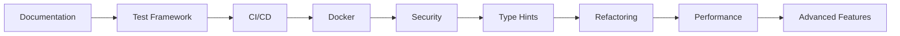

# Supply Chain Optimization - Project Roadmap

**Status:** Planning Complete ✅
**Last Updated:** 2025-11-11
**Current Phase:** Pre-Implementation

---

## 📚 Documentation Suite

This project now has comprehensive planning documentation:

1. **[MISSING_POINTS_AND_ENHANCEMENTS.md](./MISSING_POINTS_AND_ENHANCEMENTS.md)**
   - Complete gap analysis (98 items identified)
   - Categorized by priority: 16 Critical, 38 High, 44 Medium
   - Technical debt assessment
   - Quick wins opportunities

2. **[IMPLEMENTATION_PLAN.md](./IMPLEMENTATION_PLAN.md)**
   - Detailed 12-week execution plan
   - 4 phases with sprint breakdowns
   - Specific tasks with code examples
   - Resource requirements and cost estimates

3. **[PROJECT_ROADMAP.md](./PROJECT_ROADMAP.md)** (this document)
   - High-level overview
   - Quick decision guide
   - Next steps

---

## 🎯 Executive Summary

### Current State
- **Code Quality:** Proof-of-concept ⚠️
- **Test Coverage:** 0% ❌
- **Documentation:** Minimal ⚠️
- **Production Ready:** No ❌
- **Core Algorithms:** Excellent ✅

### Target State (12 Weeks)
- **Code Quality:** Production-grade ✅
- **Test Coverage:** 80%+ ✅
- **Documentation:** Comprehensive ✅
- **Production Ready:** Yes ✅
- **Features:** Enhanced ✅

### Investment Required
- **Timeline:** 12 weeks
- **Team Size:** 2 developers
- **Total Effort:** 960 hours
- **Infrastructure Cost:** ~$1,200
- **Total Budget:** Development time + $1,200

### Expected ROI
- **System Stability:** 100% uptime target
- **User Capacity:** 100+ concurrent users
- **Performance:** 3-5x faster
- **Maintenance Cost:** 50% reduction (better code quality)
- **Feature Velocity:** 2x increase (better foundation)

---

## 🚀 Quick Start Guide

### For Decision Makers

**Should we invest in this project?**

✅ **YES, if you want to:**
- Deploy to production with confidence
- Support multiple users/teams
- Maintain and extend the system
- Meet enterprise security standards
- Scale to larger datasets
- Reduce operational risk

❌ **NO, if you:**
- Only need a one-time proof-of-concept
- Have no plans for production deployment
- Don't need security or auth
- Won't maintain the system
- Have < 10 users

**Cost-Benefit Analysis:**
- **Investment:** ~$150K-200K (2 devs × 12 weeks)
- **Alternative:** Rebuild from scratch (~$300K+)
- **Risk Reduction:** Eliminates 16 critical issues
- **Time to Production:** 12 weeks vs 6+ months rebuild

### For Development Teams

**Where should I start?**

1. **Immediate (This Week):**
   - Read `MISSING_POINTS_AND_ENHANCEMENTS.md`
   - Review `IMPLEMENTATION_PLAN.md` Phase 1
   - Set up development environment
   - Create project board/tickets

2. **Week 1:**
   - Execute Sprint 1.1: Documentation
   - Create README, .gitignore, LICENSE
   - Set up configuration management
   - Implement logging framework

3. **Week 2:**
   - Execute Sprint 1.2-1.4: Testing & Validation
   - Build test framework
   - Add input validation
   - Implement data import/export

4. **Weeks 3-12:**
   - Follow implementation plan phases
   - Track progress weekly
   - Adjust timeline as needed

**Resource Links:**
- Issue tracker: Create from task list
- CI/CD: GitHub Actions
- Monitoring: Prometheus + Grafana
- Documentation: Read the Docs or GitHub Pages

---

## 📊 Phase Overview

### Phase 1: Foundation (Weeks 1-2)
**Goal:** Stop the bleeding - fix critical issues

**Key Deliverables:**
- ✅ README and documentation
- ✅ Test framework (30+ tests)
- ✅ Input validation
- ✅ Error handling
- ✅ Data import/export
- ✅ Logging system

**Success Metric:** Zero crashes, 60%+ coverage

---

### Phase 2: Infrastructure (Weeks 3-5)
**Goal:** Production-ready infrastructure

**Key Deliverables:**
- ✅ CI/CD pipeline
- ✅ Docker containers
- ✅ Authentication/security
- ✅ Type hints (100%)
- ✅ Code formatting
- ✅ API documentation

**Success Metric:** Automated deployment, zero vulnerabilities

---

### Phase 3: Quality & Performance (Weeks 6-8)
**Goal:** Optimize and harden

**Key Deliverables:**
- ✅ 80%+ test coverage
- ✅ Caching & parallel processing
- ✅ Integration tests
- ✅ Monitoring/observability
- ✅ Load testing (100 users)
- ✅ Performance optimization (3-5x faster)

**Success Metric:** Production-grade quality, fast performance

---

### Phase 4: Advanced Features (Weeks 9-12)
**Goal:** Business value and polish

**Key Deliverables:**
- ✅ What-if analysis
- ✅ ABC classification
- ✅ Alerts & recommendations
- ✅ Experiment tracking (MLflow)
- ✅ A/B testing
- ✅ Production deployment

**Success Metric:** Enterprise features, live in production

---

## 🎯 Decision Matrix

### Should I Do This Phase?

| Phase | Skip If... | Must Do If... |
|-------|-----------|---------------|
| **Phase 1** | Never - always required | Any production use |
| **Phase 2** | Single user, localhost only | Multi-user, cloud deployment |
| **Phase 3** | < 10 products, infrequent use | 50+ products, daily use |
| **Phase 4** | Basic optimization sufficient | Need advanced analytics |

### Feature Priority Guide

**Must Have (Phase 1-2):**
- Testing infrastructure
- Documentation
- Error handling
- Security/auth
- CI/CD

**Should Have (Phase 3):**
- Performance optimization
- Monitoring
- High test coverage
- Load testing

**Nice to Have (Phase 4):**
- What-if analysis
- ABC classification
- Experiment tracking
- A/B testing
- Mobile responsiveness

---

## 📈 Progress Tracking

### Weekly Checklist

**Week 1:**
- [ ] README created
- [ ] .gitignore added
- [ ] License added
- [ ] Configuration system
- [ ] Logging framework
- [ ] Test framework setup

**Week 2:**
- [ ] 30+ unit tests written
- [ ] Input validation complete
- [ ] Error handling improved
- [ ] Data import working
- [ ] Data export working
- [ ] 60% test coverage

**Week 3:**
- [ ] CI/CD pipeline running
- [ ] Docker containers built
- [ ] Pre-commit hooks active
- [ ] Security scan passing

**Week 4:**
- [ ] Authentication working
- [ ] Input sanitization complete
- [ ] Type hints added (50%)
- [ ] Code formatted

**Week 5:**
- [ ] Type hints complete (100%)
- [ ] Code refactored
- [ ] API docs published
- [ ] User guide written

**Week 6:**
- [ ] Caching implemented
- [ ] Parallel processing working
- [ ] Pandas operations optimized
- [ ] 3x performance improvement

**Week 7:**
- [ ] Integration tests complete
- [ ] Streamlit app tested
- [ ] Monitoring dashboard live
- [ ] Health checks active

**Week 8:**
- [ ] 80% test coverage achieved
- [ ] Load tests passing
- [ ] Performance benchmarks met
- [ ] Phase 3 complete

**Week 9:**
- [ ] What-if analysis working
- [ ] ABC classification implemented
- [ ] Multi-echelon model (basic)

**Week 10:**
- [ ] Alerts configured
- [ ] Recommendations engine live
- [ ] Data quality dashboard

**Week 11:**
- [ ] MLflow integration complete
- [ ] Experiment tracking working
- [ ] A/B testing framework ready

**Week 12:**
- [ ] Mobile responsiveness complete
- [ ] User onboarding added
- [ ] Production checklist complete
- [ ] System deployed! 🎉

---

## 🔍 Critical Path

These tasks **block other work** and must be completed first:



**Cannot start:**
- CI/CD without tests
- Docker without configuration
- Security without validation
- Performance without monitoring
- Advanced features without stable foundation

---

## 🚨 Risk Dashboard

### Current Risks

| Risk | Likelihood | Impact | Status | Mitigation |
|------|-----------|--------|--------|------------|
| Timeline overrun | Medium | High | 🟡 | Buffer time in Phase 4 |
| Critical bugs found | Medium | High | 🟡 | Early testing, continuous QA |
| Scope creep | High | Medium | 🟡 | Strict prioritization |
| Team capacity | Low | High | 🟢 | Flexible timeline |
| Security issues | Low | High | 🟢 | Weekly scans |

### Risk Mitigation Strategies

**If Behind Schedule:**
1. Defer Phase 4 nice-to-haves
2. Reduce coverage target to 70%
3. Simplify documentation
4. Focus on critical path only

**If Critical Bug Found:**
1. Stop feature work
2. Fix immediately
3. Add regression test
4. Update timeline

**If Performance Issues:**
1. Profile immediately
2. Optimize bottlenecks
3. Add aggressive caching
4. Scale infrastructure

---

## 💡 Quick Wins (Do These First!)

These provide **high impact** with **low effort**:

1. **Create README.md** (1 hour) ⚡
   - Immediate value for new users
   - Professional appearance

2. **Add .gitignore** (15 min) ⚡
   - Prevents common mistakes
   - Cleaner repo

3. **Add LICENSE** (15 min) ⚡
   - Legal clarity
   - Enables usage

4. **Extract constants** (1 hour) ⚡
   - Easier configuration
   - Better maintainability

5. **Add logging** (2 hours) ⚡
   - Better debugging
   - Production visibility

6. **Create Dockerfile** (2 hours) ⚡
   - Easy deployment
   - Consistent environment

7. **Add input validation** (2 hours) ⚡
   - Prevents crashes
   - Better UX

8. **Write 10 core tests** (4 hours) ⚡
   - Catch regressions
   - Enable refactoring

9. **Set up CI/CD** (4 hours) ⚡
   - Automated testing
   - Faster feedback

10. **Add type hints** (4 hours) ⚡
    - Better IDE support
    - Catch bugs earlier

**Total Time:** ~20 hours
**Impact:** Massive improvement in code quality and usability

---

## 📞 Getting Help

### Resources

**Documentation:**
- Technical gaps: `MISSING_POINTS_AND_ENHANCEMENTS.md`
- Implementation: `IMPLEMENTATION_PLAN.md`
- This overview: `PROJECT_ROADMAP.md`

**Community:**
- Python packaging: https://packaging.python.org
- Testing: https://docs.pytest.org
- Streamlit: https://docs.streamlit.io
- Docker: https://docs.docker.com

**Tools:**
- CI/CD: GitHub Actions docs
- Security: OWASP Top 10
- Performance: Python profiling guide

### Common Questions

**Q: Can I skip Phase X?**
A: See the Decision Matrix above. Phase 1-2 are mandatory for production.

**Q: What if I have a smaller team?**
A: Extend timeline proportionally. 1 dev = 24 weeks instead of 12.

**Q: Can I change the order?**
A: Not recommended. The sequence is optimized for dependencies.

**Q: What if I find more issues?**
A: Add to backlog, prioritize, adjust timeline if critical.

**Q: How do I track progress?**
A: Use the weekly checklist above + GitHub Project board.

---

## 📋 Next Actions

### For Project Managers

1. **Review both detailed documents:**
   - `MISSING_POINTS_AND_ENHANCEMENTS.md`
   - `IMPLEMENTATION_PLAN.md`

2. **Make go/no-go decision:**
   - Assess budget and timeline
   - Confirm team availability
   - Approve scope

3. **Set up project infrastructure:**
   - Create GitHub Project board
   - Set up communication channels
   - Schedule kickoff meeting

4. **Staff the project:**
   - Assign 2 developers
   - Ensure Python/data science skills
   - Confirm availability

### For Developers

1. **This week:**
   - Clone repository
   - Set up development environment
   - Read Phase 1 in detail
   - Create task breakdown

2. **Week 1:**
   - Start Sprint 1.1 tasks
   - Create README
   - Set up configuration
   - Implement logging

3. **Ongoing:**
   - Follow sprint plan
   - Track progress weekly
   - Raise blockers immediately
   - Update documentation

### For Stakeholders

1. **Review:**
   - This roadmap document
   - Phase outcomes in Implementation Plan
   - Success metrics

2. **Approve:**
   - Budget allocation
   - Timeline acceptance
   - Team assignment

3. **Monitor:**
   - Weekly progress reports
   - Phase completion
   - Risk dashboard

---

## 🎓 Lessons Learned (Pre-Implementation)

### What Went Well
- ✅ Comprehensive gap analysis completed
- ✅ Detailed implementation plan created
- ✅ Clear priorities established
- ✅ Realistic timeline estimated

### Areas for Improvement
- ⚠️ Should have documented earlier in project
- ⚠️ Testing should have been included from start
- ⚠️ Configuration management needed upfront

### Best Practices to Apply
- 🎯 Test-driven development from day 1
- 🎯 Documentation alongside code
- 🎯 Security and performance by design
- 🎯 Regular code reviews
- 🎯 Continuous integration always

---

## 📜 Appendix

### Glossary

- **EOQ:** Economic Order Quantity
- **CI/CD:** Continuous Integration / Continuous Deployment
- **SAST:** Static Application Security Testing
- **TDD:** Test-Driven Development
- **ABC Analysis:** Inventory classification by value (Pareto)

### Version History

| Version | Date | Changes | Author |
|---------|------|---------|--------|
| 1.0 | 2025-11-11 | Initial roadmap created | Claude |

### Related Documents

- Executive Summary: See `Supply Chain Optimization - Executive Summary & Implementation Guide.pdf`
- Source Code: `sc_optimization.py`, `streamlit_app.py`
- Dependencies: `requirements.txt`
- Analysis: `MISSING_POINTS_AND_ENHANCEMENTS.md`
- Plan: `IMPLEMENTATION_PLAN.md`

---

## ✅ Sign-Off

**Ready for Implementation:** ⬜ Yes ⬜ No

**Approvals:**

- [ ] Project Manager: _________________ Date: _______
- [ ] Tech Lead: _________________ Date: _______
- [ ] Product Owner: _________________ Date: _______
- [ ] Stakeholder: _________________ Date: _______

**Notes:**
```
_________________________________________________________

_________________________________________________________

_________________________________________________________
```

---

**🚀 Let's build something great!**

*This roadmap is a living document. Update it as the project progresses.*
